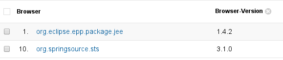

== How does it work?

=== Basic pattern 

The basic building block in usage consists of 3 classes:

* Tracker (sends the report)
* GoogleAnalyticsUrlStrategy (builds the Google Analytics report)
* JBossToolsEclipseEnvironment (collects the configurations)

=== JBossToolsEclipseEnvironment

JBossToolsEclipseEnvironment is responsible for collecting the configurations that we send to Google Analytics. Google Analytics was built to track browsers and we are thus behaving as if Eclipse was a browser. We are mapping and reformatting Eclipse settings to the ones a browser would provide. 

=== GoogleAnalyticsUrlStrategy
GoogleAnalyticsUrlStrategy queries JBossToolsEclipseEnvironment for the relevant configurations and packs them into a format specific to Google Analytics. It knows about the way Google Analytics expects its parameters and the url it should report to.

=== Tracker
The Tracker, finally, picks the parameters it gets from GoogleAnalyticsUrlStrategy and creates a HTTP GET request out of it. 

== Mapping the settings
As discussed above Google Analytics expects talking to a browser. Usage is on the other hand collecting informations from an Eclipse instance. Usage therefore has to map and translate these in order to fake a browser.

=== Browser language
In JBossToolsEclipseEnvironmane#getBrowserLanguage we report the Eclipse language settings in a way a browser would report its language. In code this looks as follows:
[source,java]
public String getBrowserLanguage() {
	String nl = Platform.getNL();
	int indexOf = nl.indexOf('_');
	return new StringBuilder()
                        .append(nl.substring(0, indexOf))
                        .append('-')
                        .append(nl.substring(indexOf + 1))
                        .toString();
}

The language of your Eclipse is then showing up in Google Analytics in the following way:

=== User Agent
To report the operating system, version and Eclipse application we encode the appropriate settings into the browser user agent. We use distinct user agents for windows, linux and macos and embed these settings into it:
[source,java]
USERAGENT_WIN = "{0}/{1} (Windows; U; Windows NT {2}; {3})";
USERAGENT_MAC = "{0}/{1} (Macintosh; U; Intel Mac OS X {2}; {3})";
USERAGENT_LINUX = "{0}/{1} (X11; U; Linux i686; {3})";

In Google Analytics the Eclipse Application will show up as browser:

=== Linux Distribution
Google Analytics is unfortunately not able to report distinct linux distributions. Via the user agent it will only report Linux as gross cathegory. To get to know what distribution our users run we report them in a user defined parameter:

[source,java]
public String getUserDefined() {
        return getLinuxDistroNameAndVersion();
}

In Google Analytics the linux distributions may get queried as second dimension:

=== Java Version
Google Analytics is not tracking java versions. We therefore misuse the flash plugin version it is keeping track of. We send the java version where Google expects the version of the flash plugin. 

[source,java]
public String getFlashVersion() {
        return getJavaVersion();
}

[source,java]
private String getJavaVersion() {
        return System.getProperty(SYSPROP_JAVA_VERSION);
}

In Google Analytics you'll then spot the java version in the following way:

== Branding
Usage should should report differently if run in JBoss Developer Studio compared to JBoss Tools. This affects labels, tracking url and account. To achieve this we provide an interface that may usage is getting these elements from:
[source,java]
public interface IUsageBranding { 
  public String getStartupAllowReportingTitle();
        public String getStartupAllowReportingMessage();
        public String getGoogleAnalyticsAccount();
        public String getGoogleAnalyticsReportingHost()

The usage plugin in JBoss Tools runs a default implementation. These defaults may be overriden by an OSGI service. This is what JBoss Developer Studio does, it registers it's very own branding service implementation. It does this via an additional plugin (com.jboss.jbds.usage.branding) that's available in JBoss Developer Studio only.

